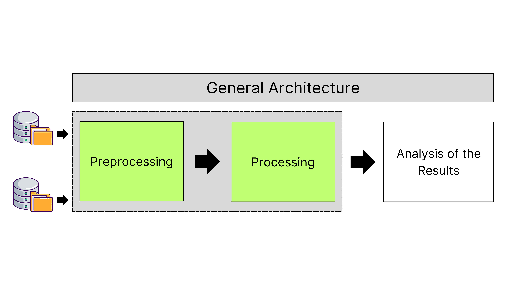
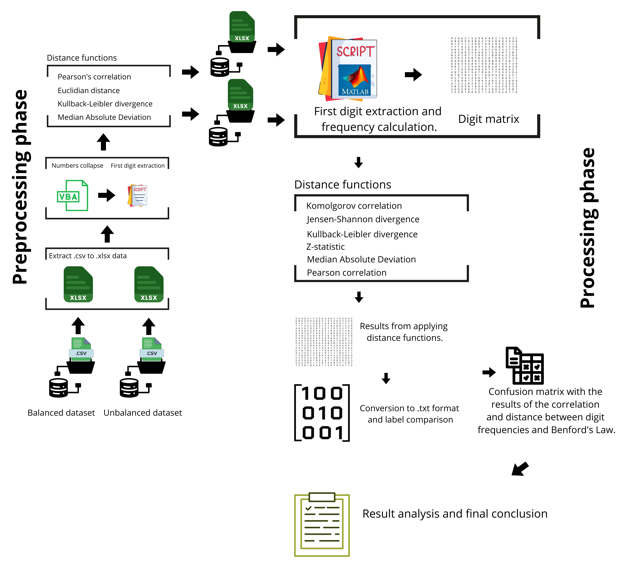

# Distance-based-feature-selection-using-Benford-s-law-for-malware-detection
Innovative use of Benford's law to identify significant features in data flows, evaluating compliance with expected numerical patterns through distance functions.

+ Pedro Fernandes - Department of Computer Engineering; Technological University of the Shannon; Limerick, Ireland; Pedro.Fernandes@tus.ie ; Mathematics Department; Polytechnic Institute of Leiria; Leiria, Portugal; pedro.a.fernandes@ipleiria.pt

+ Séamus Ó Ciardhuáin - Department of Computer Engineering; Technological University of the Shannon; Limerick, Ireland; seamus.ociardhuain@tus.ie

+ Mário Antunes - Computer Science and Communication Research Centre (CIIC), School of Technology and Management, Polytechnic of Leiria; Leiria; Portugal; mario.antunes@ipleiria.pt; INESC TEC, CRACS; Porto; Portugal

## Enhanced Malware Detection Using Benford’s Law and Distance Functions

### Project Description

This repository presents an advanced approach for detecting malware in data flows from computer networks and Android devices. The methodology integrates Benford’s Law with various statistical models and distance functions, including mean absolute deviation (MAD), Kolmogorov test, Kullback-Leibler (KL) divergence, Jensen-Shannon (JS) divergence, Z-statistics, Euclidean distance, and Pearson correlation. This approach aims to enhance the detection of malicious flows by quantifying discrepancies between expected and observed distributions.

### General architecture 

The pre-processing and processing phases are outlined below.

### Methodology

The analysis is conducted in two main stages:

1. **Feature Selection:**
   - Utilizes MAD, KL divergence, Euclidean distance, and Pearson correlation to select the most significant features.

2. **Model Evaluation and Validation:**
   - Employs MAD, Kolmogorov test, KL divergence, JS divergence, Z-statistics, and Pearson correlation to assess model performance.

This two-stage approach ensures precise quantitative assessment of the differences between benign and malicious flows while addressing classic challenges such as redundancy and unbalanced datasets.

### Datasets

The study uses two public datasets: one balanced and one unbalanced, providing comprehensive testing scenarios.

#### **1. CIC MalMem 2022 Dataset**

- Represents real-world situations involving prevalent malware: Spyware, Ransomware, and Trojan Horses.
- Balanced dataset: 58,596 records (29,298 benign and 29,298 malicious).

**Complete List of 55 Features:**

| pslist.nproc | pslist.nppid | pslist.avg_threads | pslist.nprocs64bit | pslist.avg_handlers |
|--------------|---------------|--------------------|--------------------|---------------------|
| dlllist.ndlls | dlllist.avg_dlls_per_proc | handles.nhandles | handles.avg_handles_per_proc | handles.nport |
| handles.nfile | handles.nevent | handles.ndesktop | handles.nkey | handles.nthread |
| handles.ndirectory | handles.nsemaphore | handles.ntimer | handles.nsection | handles.nmutant |
| ldrmodules.not_in_load | ldrmodules.not_in_init | ldrmodules.not_in_mem | ldrmodules.not_in_load_avg | ldrmodules.not_in_init_avg |
| ldrmodules.not_in_mem_avg | malfind.ninjections | malfind.commitCharge | malfind.protection | malfind.uniqueInjections |
| psxview.not_in_pslist | psxview.not_in_eprocess_pool | psxview.not_in_ethread_pool | psxview.not_in_pspcid_list | psxview.not_in_csrss_handles |
| psxview.not_in_session | psxview.not_in_deskthrd | psxview.not_in_pslist_false_avg | psxview.not_in_eprocess_pool_false_avg | psxview.not_in_ethread_pool_false_avg |
| psxview.not_in_pspcid_list_false_avg | psxview.not_in_csrss_handles_false_avg | psxview.not_in_session_false_avg | psxview.not_in_deskthrd_false_avg | modules.nmodules |
| svcscan.nservices | svcscan.kernel_drivers | svcscan.fs_drivers | svcscan.process_services | svcscan.shared_process_services |
| svcscan.interactive_process_services | svcscan.nactive | callbacks.ncallbacks | callbacks.nanonymous | callbacks.ngeneric |

---

#### **2. Android Malware Detection Dataset**

- Contains four labels: AndroidAdware, Android-Scareware, Android-SMS-Malware, and Benign.
- Unbalanced dataset: 355,630 records distributed as follows:

| Attack Types             | Instances  |
|--------------------------|-------------|
| AndroidAdware            | 147,443     |
| Android-Scareware        | 117,082     |
| Android-SMS-Malware      | 67,397      |
| Benign                   | 23,708      |
| **Total**                | **355,630** |

**Complete List of 75 Features:**

| Source Port | Destination Port | Protocol | Flow Duration | Total Fwd Packets |
|-------------|-------------------|----------|----------------|--------------------|
| Total Backward Packets | Total Length of Fwd Packets | Total Length of Bwd Packets | Fwd Packet Length Max | Fwd Packet Length Min |
| Fwd Packet Length Mean | Fwd Packet Length Std | Bwd Packet Length Max | Bwd Packet Length Min | Bwd Packet Length Mean |
| Bwd Packet Length Std | Flow Bytes/s | Flow Packets/s | Flow IAT Mean | Flow IAT Std |
| Flow IAT Max | Flow IAT Min | Fwd IAT Total | Fwd IAT Mean | Fwd IAT Std |
| Fwd IAT Max | Fwd IAT Min | Bwd IAT Total | Bwd IAT Mean | Bwd IAT Std |
| Bwd IAT Max | Bwd IAT Min | Fwd PSH Flags | Bwd PSH Flags | Fwd URG Flags |
| Bwd URG Flags | Fwd Header Length | Bwd Header Length | Fwd Packets/s | Bwd Packets/s |
| Min Packet Length | Max Packet Length | Packet Length Mean | Packet Length Std | Packet Length Variance |
| FIN Flag Count | SYN Flag Count | RST Flag Count | PSH Flag Count | ACK Flag Count |
| URG Flag Count | CWE Flag Count | ECE Flag Count | Down/Up Ratio | Average Packet Size |
| Avg Fwd Segment Size | Avg Bwd Segment Size | Fwd Header Length.1 | Fwd Avg Bytes/Bulk | Subflow Fwd Packets |
| Subflow Fwd Bytes | Subflow Bwd Packets | Subflow Bwd Bytes | Init_Win_bytes_forward | Init_Win_bytes_backward |
| act_data_pkt_fwd | min_seg_size_forward | Active Mean | Active Std | Active Max |
| Active Min | Idle Mean | Idle Std | Idle Max | Idle Min |

### Data Preparation

- **Number Collapse:** Adjusted decimal numbers with leading zeros.
- **Modulus Calculation:** Ensured compatibility with Benford’s Law by handling negative values.
- **Feature Filtering:** Removed features with only zeros or a single digit.

## Summary and Best Results of Model Performance on Balanced Dataset

The research focused on analysing the **CIC MalMem 2022** balanced dataset, containing 58,596 flows (50% benign and 50% malicious). The study applied various distance functions, including **MAD**, **Pearson's correlation**, **Kullback-Leibler (KL) divergence**, **Kolmogorov test**, **Z-statistics**, **Jensen-Shannon divergence**, and **Euclidean distance** for feature selection and model evaluation.

Key findings include:
- **Initial Analysis:** 43 features were considered after removing features incompatible with Benford's law.
- **Feature Selection:**
  - **Kullback-Leibler divergence** selected 5 key features.
  - **Pearson correlation** selected 7 key features.
- **Model Evaluation:**
  - The best performance was achieved by combining **Kullback-Leibler divergence** with **Pearson's correlation** at a significance level of 0.1, resulting in:
    - **Accuracy:** 85.60%
    - **F1 Score:** 85.08%
    - **Precision:** 88.30%
    - **Recall:** 82.08%

Comparisons were made with machine learning classifiers such as **Random Forest (RF)**, **Decision Tree (DT)**, and **KNN**, which outperformed statistical models but demonstrated the competitive potential of the distance-based approach.

---

### Best Results Summary Table

| **Distance Function Combination**                | **Precision** | **Recall** | **F1 Score** | **Accuracy** |
|--------------------------------------------------|---------------|------------|--------------|--------------|
| **KL + Pearson (Significance 0.1)**              | 0.88          | 0.82       | 0.85         | 0.86         |
| **Pearson + Kolmogorov (Significance 0.01)**     | 0.71          | 0.85       | 0.77         | 0.75         |
| **MAD + Pearson (Significance 0.05)**            | 0.53          | 0.68       | 0.66         | 0.55         |
| **Z-statistics + Euclidean Distance**            | 0.51          | 0.98       | 0.67         | 0.52         |
| **Jensen-Shannon + Pearson Correlation**         | 0.53          | 0.71       | 0.60         | 0.54         |

---

### Comparison with Machine Learning Classifiers

| **Classifier**                                   | **Precision** | **Recall** | **F1 Score** | **Accuracy** |
|--------------------------------------------------|---------------|------------|--------------|--------------|
| **Random Forest (RF)**                           | 0.98          | 0.97       | 0.97         | 0.97         |
| **Decision Tree (DT)**                           | 0.97          | 0.97       | 0.97         | 0.97         |
| **KNN**                                          | 0.95          | 0.95       | 0.95         | 0.95         |
| **Naive Bayes (NB)**                             | 0.92          | 0.92       | 0.92         | 0.92         |
| **SVM**                                          | 0.91          | 0.90       | 0.90         | 0.90         |
| **KL + Pearson Correlation (Proposed Approach)**  | 0.88          | 0.82       | 0.85         | 0.86         |

---

Although machine learning methods achieved higher overall metrics, the proposed distance-function approach, especially the combination of **Kullback-Leibler divergence** with **Pearson's correlation**, produced competitive results. The findings suggest that statistical distance functions can effectively complement traditional ML approaches in detecting malware, particularly in scenarios where interpretability and feature relevance are critical.

## Summary and Best Results of Model Performance on Unbalanced Dataset

The second phase of the research analysed an **unbalanced dataset** consisting of 66,216 flows (61,442 malicious and 4,774 benign). After applying distance functions for feature selection and model evaluation, only the most relevant features were retained, significantly improving model performance.

**Key highlights:**
- **Feature Selection:**
  - Initially, 38 out of 75 features were considered.
  - **Kullback-Leibler divergence** selected 18 features based on divergence values between 0.01 and 0.20.
  - **Pearson's correlation** selected 13 features with a correlation greater than 80%.
  - **Euclidean distance** selected 12 features based on distances less than 0.2.

- **Model Evaluation:**
  - **Best Performance:** Combination of **Pearson's correlation** and **Kolmogorov test**, achieving:
    - **Precision:** 92.75%
    - **Recall:** 97.98%
    - **F1 Score:** 95.29%
    - **Accuracy:** 91.02%

- Other high-performing combinations included:
  - **Pearson + MAD:** F1 score of 95.14%, Accuracy of 90.73%
  - **Kullback-Leibler + Z-statistics:** F1 score of 91.34%, Accuracy of 84.16%

---

### Best Results Summary Table

| **Distance Function Combination**                | **Precision** | **Recall** | **F1 Score** | **Accuracy** |
|--------------------------------------------------|---------------|------------|--------------|--------------|
| **Pearson + Kolmogorov (Significance 0.1)**      | 0.9275        | 0.9798     | 0.9529       | 0.9102       |
| **Pearson + MAD**                               | 0.9276        | 0.9763     | 0.9514       | 0.9073       |
| **Kullback-Leibler + Z-statistics**              | 0.9274        | 0.8998     | 0.9134       | 0.8416       |
| **Kullback-Leibler Only**                       | 0.9273        | 0.8997     | 0.9133       | 0.8414       |
| **Jensen-Shannon + Pearson Correlation**         | 0.9270        | 0.6700     | 0.7778       | 0.6448       |

---

### Confusion Matrix for Best F1 Results

| **Evaluation Metric**      | **Kullback-Leibler** | **Pearson** | **MAD**  | **Kolmogorov** | **Z-statistics** | **Jensen-Shannon** |
|----------------------------|----------------------|-------------|----------|-----------------|-------------------|--------------------|
| **Kullback-Leibler**       | 0.9133               | 0.6311      | 0.9003   | 0.4013          | 0.9134            | 0.7778             |
| **Pearson Correlation**    | 0.9215               | 0.6804      | 0.9514   | 0.9529          | 0.9184            | 0.7638             |
| **Euclidean Distance**     | 0.9135               | 0.5766      | 0.8411   | 0.7255          | 0.9126            | 0.8040             |

---

### Conclusion

The results demonstrate that the **Pearson correlation combined with the Kolmogorov test** delivers the best performance for unbalanced datasets, achieving an F1 score of **95.29%**. The **Kullback-Leibler divergence** and **Z-statistic** also proved effective, consistently yielding high F1 scores and accuracy values.

Despite these promising results, challenges remain, notably in reducing false positives for the minority class. Future work should explore:
- Robust threshold definitions
- Advanced dimensionality reduction techniques
- Enhanced preprocessing strategies to mitigate outliers and noise.

This approach highlights the importance of carefully combining distance functions and correlation metrics, ensuring robust malware detection in unbalanced datasets.

## Contact

<a href="mailto:Pedro.Fernandes@tus.ie" title="Send an email">
  
  Pedro.Fernandes@tus.ie
</a>

# Publications

+ Distance-based feature selection using Benford’s law for malware detection, Computers & Security, Vol. 158, p. 104625, (https://doi.org/10.1016/j.cose.2025.104625)
, [URL](https://doi.org/10.1016/j.cose.2025.104625)
